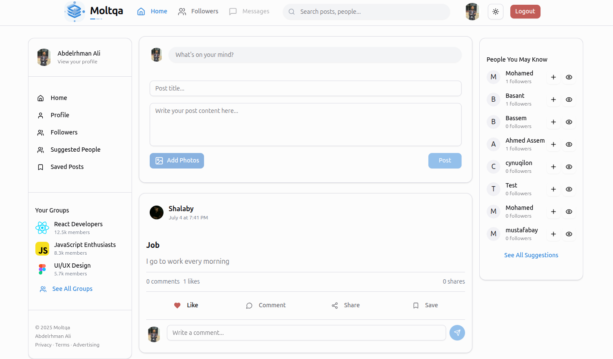

# 🟦 Moltqa

**Moltqa** is a modern, full-featured social media app built using **React + Vite** for the frontend and a custom **Node.js backend**—both developed and deployed by [Abdelrahman Ali](https://github.com/abdelrhman1812).

🚀 The frontend is deployed on **Vercel**, and the backend is hosted with full API integration.

---

## 🔗 Live Demo & Backend Repository

  
  &nbsp;
  

---

## 📚 Overview

- Full SPA built with **React + Vite**
- Backend built and deployed by **Abdelrahman Ali** using **Node.js + Express**
- Integration via RESTful APIs
- JWT authentication, secure routes
- Full social features: posting, commenting, following
- Modern UI with **TailwindCSS + Radix UI**
- Fully responsive with Dark Mode

---

## ⚙️ Technologies Used

### 🧩 UI & Styling

| Tool / Library             | Purpose                    |
| -------------------------- | -------------------------- |
| **Tailwind CSS**           | Utility-first CSS styling  |
| **Radix UI (shadcn/ui)**   | Accessible UI components   |
| **Framer Motion**          | Animations and transitions |
| **Lucide React**           | Icons                      |
| **React-loading-skeleton** | UX loading skeletons       |

### 🔗 Backend Integration

| Tool / Library          | Purpose                     |
| ----------------------- | --------------------------- |
| **Axios**               | API communication           |
| **Custom `useRequest`** | Unified request abstraction |
| **JWT Decode**          | Token parsing               |
| **JS-Cookie**           | Cookie-based session        |

### 🧠 State Management

| Tool             | Purpose                 |
| ---------------- | ----------------------- |
| **Context API**  | Auth and Theme state    |
| **React Query**  | Server state management |
| **Formik + Yup** | Forms & validation      |

---

## ✅ Features

### 🔐 Auth & Access

- Login / Register / Forgot Password
- Auth state managed via Context API + cookies
- Protected routes

### 📄 Posts & Comments

- Create, edit, delete posts with images
- Like / unlike posts
- Add, edit, delete comments
- Like / unlike comments

### 👥 Social Features

- Follow / unfollow users
- View & edit user profiles
- Suggested users to follow

### ⚙️ Dev Tools & Hooks

- Custom hooks: `usePosts`, `useFollow`, `useComments`, etc.
- Axios abstraction via `useRequest`
- Toast notifications
- Centralized API error handling

### 🌗 Dark Mode

- Switch themes using context
- Theme saved in localStorage

---
